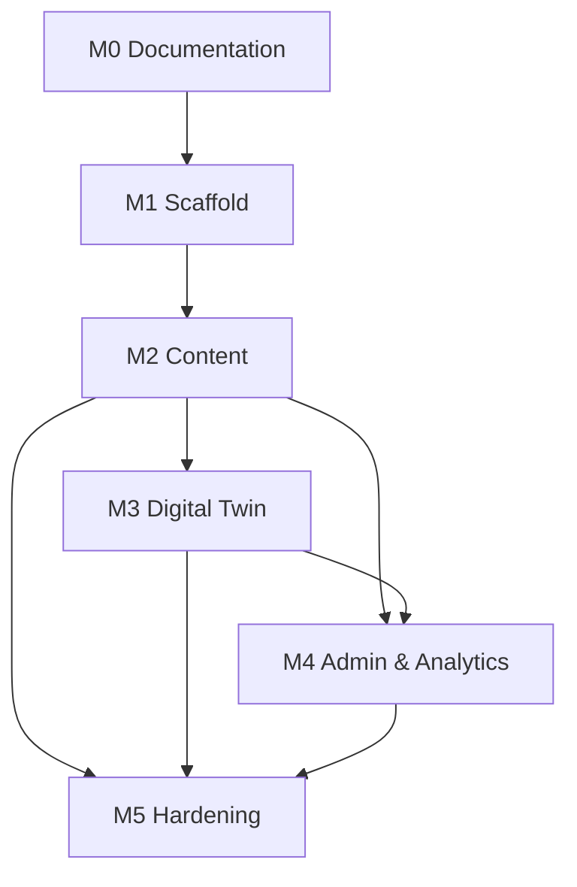

# Product Roadmap

## Purpose

Sequence delivery of the AI Engineering Portfolio Platform in milestones with clear deliverables, dependencies, and definitions of done.

## Scope

Covers product milestones from current scaffold through v1 launch and post-launch evolution. Technical task breakdowns live in per-feature `tasks.md` files.

## Responsibilities

| Role | Responsibility |
|------|----------------|
| Product owner | Prioritize milestones and resolve dependency conflicts |
| Tech lead | Validate feasibility and align architecture with milestones |
| Engineers & agents | Execute feature tasks within milestone boundaries |

---

## Current State

The repository (`portfolio-red`) is a **Turborepo monorepo** with:

- `apps/web` — production Next.js app (Docker / EC2 deploy target)
- `packages/ui`, `packages/database`, `packages/ai`, `packages/eslint-config`, `packages/typescript-config`
- AWS ECR → EC2 deployment pipeline
- CI quality gates (lint, typecheck, build)

M1 platform scaffold is complete. Feature implementation continues in M2+.

---

## Milestones

### M0 — Documentation Foundation

**Deliverables**

- Complete `docs/` structure (product, architecture, features, agents, ADRs, standards, development, deployment, observability)
- ADRs for monorepo, Next.js, shadcn, Prisma, RAG
- Feature briefs for all v1 features

**Dependencies:** None

**Definition of Done**

- [x] All required markdown files exist and pass internal review
- [x] Cross-references between docs resolve
- [x] ADRs marked Accepted for foundational decisions

---

### M1 — Platform Scaffold

**Deliverables**

- Tailwind CSS + shadcn/ui in `apps/web`
- Prisma + PostgreSQL + pgvector setup
- Shared packages: `@repo/database`, `@repo/ai` (skeleton)
- Environment variable template (`.env.example`)
- Local Docker Compose for PostgreSQL

**Dependencies:** M0, ADR-0001 through ADR-0004

**Definition of Done**

- [x] `pnpm dev` runs web with design tokens applied
- [x] Migrations apply cleanly on fresh database
- [x] CI runs lint, typecheck, and build

---

### M2 — Core Content Features (Current)

**Deliverables**

- Landing page (marketing hero, CTA, feature highlights)
- Portfolio overview (skills, experience timeline)
- Projects (list, detail, filters)
- Articles (list, detail, MDX rendering)
- Contact form with validation and persistence

**Dependencies:** M1, design system, database schema

**Definition of Done**

- [ ] All routes meet acceptance criteria in `docs/02-features/*/acceptance.md`
- [ ] Lighthouse a11y ≥ 95 on public pages
- [ ] Content manageable via seed scripts (admin UI deferred to M4)

---

### M3 — Digital Twin & RAG

**Deliverables**

- Knowledge ingestion pipeline (projects, articles)
- Embeddings + vector search (pgvector)
- AI Gateway with streaming, token accounting, provider abstraction
- Digital twin chat UI with source attribution
- Guardrails and rate limiting

**Dependencies:** M2 (content to ingest), ADR-0005

**Definition of Done**

- [ ] Chat streams responses with cited sources
- [ ] Token usage logged per session
- [ ] Rate limits enforced per IP/session
- [ ] Prompt evaluation suite passes baseline thresholds

---

### M4 — Admin & Analytics

**Deliverables**

- Admin authentication and authorization
- CRUD for projects, articles, site settings
- Analytics dashboard (page views, chat sessions, popular content)
- Receipt feature (transaction/expense tracking for portfolio owner ops)

**Dependencies:** M2, M3

**Definition of Done**

- [ ] Admin routes protected; RBAC enforced
- [ ] Analytics events captured with privacy-conscious defaults
- [ ] Receipt CRUD and export functional

---

### M5 — Production Hardening

**Deliverables**

- Full observability stack (logging, metrics, tracing, alerts)
- Dokploy deployment option documented alongside EC2
- Performance and E2E test suites in CI
- Security review and dependency audit automation

**Dependencies:** M2–M4

**Definition of Done**

- [ ] Health checks and rollback documented and tested
- [ ] On-call runbook in `docs/07-deployment/deployment.md`
- [ ] All v1 success metrics from [vision.md](./vision.md) measurable

---

## Dependencies (Cross-Cutting)

| Dependency | Blocks |
|------------|--------|
| Design system tokens | All UI features |
| Prisma schema | Content, analytics, receipts |
| pgvector | RAG, digital twin |
| AI provider API keys | Digital twin (M3) |
| Admin auth | Admin, receipt, sensitive analytics |

---

## Definition of Done (Global)

Every feature merged to `main` must:

1. Satisfy acceptance criteria in its feature folder
2. Include or update relevant documentation
3. Pass lint, typecheck, and unit tests
4. Not regress accessibility baselines
5. Log appropriately (no PII in info-level logs without justification)

---

## Future Roadmap

| Phase | Focus |
|-------|-------|
| **v1.1** | MDX CMS improvements, image optimization pipeline, email notifications |
| **v1.2** | Scheduled content publishing, RSS/Atom feeds, Open Graph automation |
| **v2** | Optional multi-site, plugin architecture for portfolio sections |
| **v2+** | Public read API, webhook integrations, advanced RAG (hybrid search) |

## Best Practices

- Ship vertical slices (one feature end-to-end) rather than horizontal layers only.
- Keep milestones demoable — each should have a clear user-visible outcome.
- Update this roadmap when ADRs change foundational assumptions.

## Examples

**Good milestone scope:** M2 delivers a readable article detail page with SEO metadata and accessible typography.

**Overscoped:** M2 includes full admin CMS, AI chat, and payment processing.

## Anti-patterns

- Starting M3 before publishable content exists to ingest.
- Parallelizing features that share schema migrations without coordination.
- Marking milestones done without checking feature `acceptance.md` files.

## Future Improvements

- Link milestone status to GitHub Projects or issue milestones.
- Add estimated complexity (S/M/L) per feature in `tasks.md`.

## References

- [Vision](./vision.md)
- [Engineering Principles](./engineering-principles.md)
- [Development Workflow](../06-development/workflow.md)
- [Feature Index](../02-features/)
