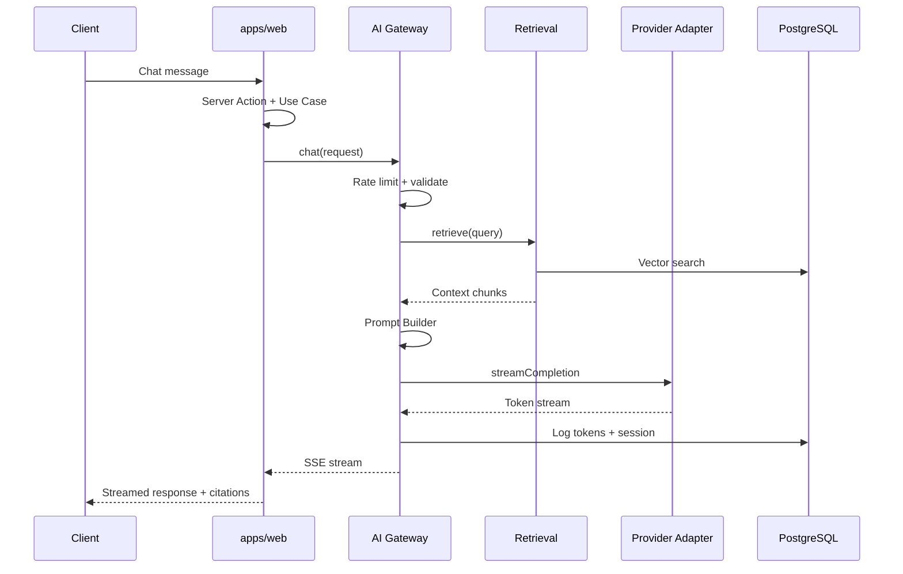

# AI Architecture

## Purpose

Describe the AI subsystem: gateway, prompt construction, retrieval integration, streaming, token accounting, and provider abstraction for the digital twin and future AI features.

## Scope

Covers server-side AI infrastructure in `packages/ai` and its consumption from `apps/web` via **use cases and services** — never from UI components directly. See [engineering-architecture.md](./engineering-architecture.md). RAG pipeline details are in [rag.md](./rag.md).

## Responsibilities

| Component | Responsibility |
|-----------|----------------|
| AI Gateway | Single entry point for LLM calls; auth, rate limits, logging |
| Prompt Builder | System + user message assembly with templates |
| Retrieval Service | Fetch relevant chunks (delegates to RAG layer) |
| Provider Adapter | Normalize OpenAI, Anthropic, and other APIs |
| Token Accountant | Count and persist usage for cost monitoring |
| Stream Handler | SSE/chunk streaming to clients |

---

## Application Layer Flow

AI is invoked through the same layered flow as other features:

```text
Page / Client → Server Action → Chat Use Case → Chat Service → AI Gateway → Retriever → Prompt Builder → LLM → Formatter
```

| Layer | Location | Role |
|-------|----------|------|
| Server Action | `features/digital-twin/actions/` | Zod validation; invoke use case |
| Use Case | `features/digital-twin/use-cases/` | Orchestrate chat session, persistence |
| Chat Service | `features/digital-twin/services/` or `@repo/ai` | Business rules; call gateway |
| AI Gateway | `packages/ai` | Provider calls, rate limits, streaming |

**Pages and components must never call AI providers directly.**

---

## High-Level Flow



---

## AI Gateway

The gateway is the **only** module allowed to call external LLM APIs from application code.

### Responsibilities

- Validate and sanitize inbound messages
- Enforce rate limits (per IP, session, user)
- Invoke retrieval and prompt builder
- Select model via configuration
- Stream or complete responses
- Emit structured logs and metrics
- Record token usage

### Interface (conceptual)

```typescript
type ChatRequest = {
  sessionId: string;
  message: string;
  metadata?: { userAgent?: string; locale?: string };
};

type ChatResponse = AsyncIterable<ChatChunk>;

type ChatChunk =
  | { type: "text"; delta: string }
  | { type: "citation"; sourceId: string; title: string; url: string }
  | { type: "done"; usage: TokenUsage };
```

### Configuration

| Env var | Purpose |
|---------|---------|
| `AI_PROVIDER` | `openai` \| `anthropic` \| ... |
| `AI_MODEL` | Default model ID |
| `AI_MAX_TOKENS` | Output cap per request |
| `AI_RATE_LIMIT_RPM` | Requests per minute per key |
| `OPENAI_API_KEY` / `ANTHROPIC_API_KEY` | Provider credentials |

---

## Prompt Builder

Assembles messages from:

1. **System prompt** — Role, tone, guardrails, citation requirements
2. **Retrieved context** — Numbered sources with metadata
3. **Conversation history** — Truncated to token budget
4. **User message** — Current question

### Design rules

- Require the model to cite source IDs for factual claims
- Instruct refusal when context is insufficient
- Keep system prompt versioned (`prompts/digital-twin-v1.ts`)
- Never inject unsanitized HTML from retrieved content

```typescript
// Conceptual structure
const messages = [
  { role: "system", content: buildSystemPrompt({ version: "v1" }) },
  { role: "user", content: buildContextBlock(chunks) + userMessage },
];
```

---

## Retrieval

The gateway calls the retrieval service defined in [rag.md](./rag.md). The gateway does **not** embed queries directly — retrieval owns embedding and vector search.

---

## Streaming

- Use provider-native streaming APIs
- Normalize to `ChatChunk` events in the gateway
- Forward via Server Actions or Route Handlers using `ReadableStream`
- Client consumes with Vercel AI SDK or custom SSE parser
- Send citations as discrete events before or after text blocks

### Error handling during stream

- Emit `{ type: "error", code, message }` chunk
- Close stream cleanly; do not leave hanging connections
- Log provider errors with request ID, not user message content at error level if PII concern

---

## Token Accounting

Every completion records:

| Field | Description |
|-------|-------------|
| `sessionId` | Chat session |
| `model` | Model identifier |
| `promptTokens` | Input tokens |
| `completionTokens` | Output tokens |
| `totalCost` | Estimated USD (from price table) |
| `timestamp` | UTC |

Persist to `AiUsage` table (see [database.md](./database.md)). Aggregate for dashboards in [observability](../08-observability/observability.md).

---

## Provider Abstraction

```typescript
interface LlmProvider {
  streamChat(params: StreamChatParams): AsyncIterable<ProviderChunk>;
  countTokens?(text: string): number;
}
```

| Adapter | Notes |
|---------|-------|
| OpenAI | Chat Completions / Responses API |
| Anthropic | Messages API with streaming |

Switch providers via `AI_PROVIDER` without changing feature code. Model-specific quirks stay inside adapters.

---

## Guardrails

- Max message length (characters and tokens)
- Blocked topics list (configurable)
- No execution of user-provided code
- Refusal templates when retrieval returns low similarity scores
- Optional moderation API pass on user input

---

## Best Practices

- All LLM calls go through the gateway — no direct SDK usage in features.
- Version prompts; bump version when behavior changes materially.
- Log retrieval IDs attached to each response for debugging.
- Set timeouts on provider calls (e.g., 30s).
- Feature-flag new models in admin before default switch.

## Examples

**Digital twin question:** Gateway retrieves top-5 chunks from projects/articles, builds prompt, streams answer with `[source:project:slug]` citations mapped to URLs.

**Provider outage:** Gateway returns graceful error chunk; UI shows "AI temporarily unavailable" with link to contact.

## Anti-patterns

- Passing full database rows into prompts instead of curated chunks.
- Streaming without token logging (blind to cost).
- Client-side API keys for LLM providers.
- Unbounded conversation history in context window.

## Future Improvements

- Multi-model routing (cheap model for classification, premium for answer)
- Cached embeddings for frequent queries
- Evaluation harness (golden questions + expected citations)
- Tool calling for structured actions (e.g., "show project X")

## References

- [Engineering Architecture](./engineering-architecture.md)
- [RAG Architecture](./rag.md)
- [AI Standards](../05-standards/ai-standards.md)
- [ADR-0005: RAG with pgvector](../04-adr/0005-rag.md)
- [Digital Twin Feature](../02-features/digital-twin/technical.md)
- [Observability](../08-observability/observability.md)
