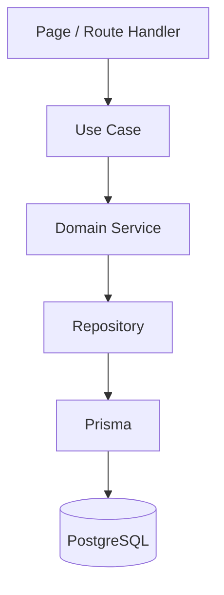
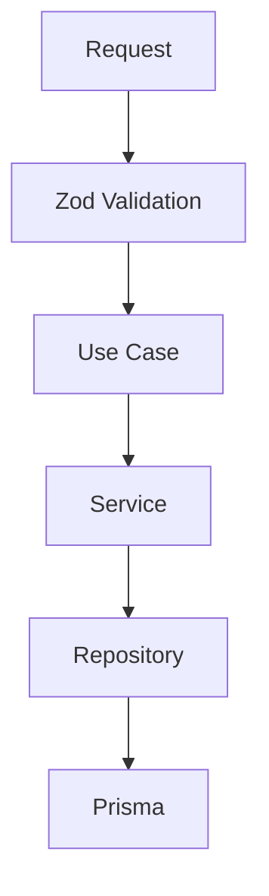
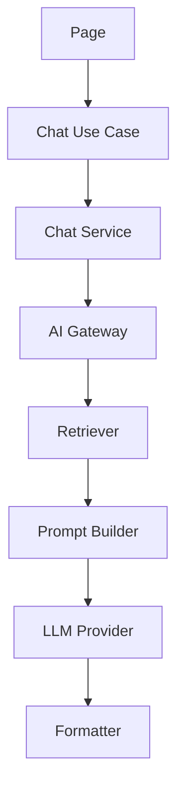

# Engineering Architecture

## Purpose

Define the engineering architecture, development principles, and implementation standards for the AI Engineering Portfolio Platform.

This document is the **primary architecture reference for all AI agents** involved in the project. Every implementation must follow these principles unless an [Architecture Decision Record (ADR)](../04-adr/README.md) explicitly approves an exception.

## Scope

Applies to all code in `apps/web`, `packages/*`, and cross-cutting concerns (validation, AI, data access). Specialized topics are expanded in sibling documents but must not contradict this foundation.

## Responsibilities

| Audience | Responsibility |
|----------|----------------|
| AI agents | Read this document before implementing any feature |
| Human engineers | Enforce architecture in design and code review |
| Architect agent | Maintain this document and author ADRs for exceptions |
| Reviewer agent | Block merges that violate prohibited practices |

---

## Architecture Philosophy

The portfolio is **not a marketing website**. It is a **production-quality software product** that demonstrates engineering capability, AI engineering, software architecture, and product thinking.

The codebase prioritizes:

- Maintainability
- Scalability
- Readability
- Testability
- Reusability
- Simplicity

The preferred solution is always the **simplest architecture that satisfies the current business requirement**.

---

## Core Principles

### Feature-First Architecture

The application is organized around **business domains**, not technical layers.

Each feature owns its:

- Components
- Services
- Use cases
- Hooks
- Types
- Schemas
- Constants
- Utilities
- Tests
- Assets

Features remain **highly cohesive** and **loosely coupled**.

### Separation of Concerns

Every layer has a single responsibility.

| Layer | Responsibility |
|-------|----------------|
| Route Handler | HTTP entry point only |
| Page | Compose UI only |
| Layout | Layout composition only |
| Components | UI rendering only |
| Hooks | Client-side interaction and state |
| Use Cases | Application orchestration |
| Services | Business rules |
| Repositories | Data access |
| Prisma | Database interaction |
| Database | Data persistence |

**Business logic must never exist inside pages, layouts, or UI components.**

### Thin Files Principle

Pages, layouts, route handlers, and server actions must remain intentionally small.

They may:

- Receive requests
- Validate input (Zod)
- Invoke use cases
- Render UI or return responses

They must **not**:

- Perform business logic
- Execute database queries directly
- Build AI prompts
- Transform business models beyond presentation mapping

---

## Application Flow

Every request follows this flow:



Each layer has a single responsibility. **Reverse dependencies are prohibited.**

---

## Service Layer

Business logic belongs **exclusively** inside services.

Services should:

- Be framework independent
- Be reusable across use cases
- Be independently testable
- Avoid UI dependencies
- Avoid ORM-specific logic (delegate to repositories)

Example services:

| Service | Domain |
|---------|--------|
| `PortfolioService` | Portfolio overview, skills, experience |
| `ProjectService` | Project CRUD, publishing, featured logic |
| `ArticleService` | Article CRUD, publishing |
| `ChatService` | Digital twin sessions, message handling |
| `AnalyticsService` | Event aggregation, reporting |
| `ReceiptService` | Receipt tracking and export |
| `ContactService` | Contact submission rules |

```typescript
// features/projects/services/project.service.ts (example)
export class ProjectService {
  constructor(private readonly projectRepo: ProjectRepository) {}

  async publishProject(slug: string): Promise<Project> {
    const project = await this.projectRepo.findBySlug(slug);
    if (!project) throw new NotFoundError("Project not found");
    if (project.status === "PUBLISHED") return project;
    return this.projectRepo.updateStatus(slug, "PUBLISHED", new Date());
  }
}
```

---

## Use Case Layer

Use cases **orchestrate** application workflows. They coordinate services, validation results, and side effects (e.g., trigger ingestion) without containing deep business rules.

```typescript
// features/projects/use-cases/publish-project.use-case.ts (example)
export async function publishProjectUseCase(slug: string) {
  const project = await projectService.publishProject(slug);
  await ingestionService.enqueueProject(project.id);
  return project;
}
```

Server Actions and route handlers invoke use cases — not services or repositories directly when orchestration is required.

---

## Repository Pattern

Repositories isolate data access from business logic.

### Repositories are responsible for

- Database queries
- Transactions
- Mapping database models to domain types

### Repositories are not responsible for

- Business logic
- Request validation
- Authorization decisions
- AI processing

**The UI must never access Prisma directly.**

Repositories live in `packages/database/src/repositories/` and are consumed by feature services.

```typescript
// packages/database/src/repositories/project.repository.ts (example)
export class ProjectRepository {
  async findPublishedProjects(): Promise<Project[]> {
    return prisma.project.findMany({
      where: { status: "PUBLISHED" },
      orderBy: { publishedAt: "desc" },
    });
  }
}
```

Prefer **intent-based methods** over generic CRUD:

- `findPublishedProjects()` not `findMany({ where: ... })` scattered in services
- `getFeaturedArticles()`
- `createConversation()`

---

## Prisma Guidelines

Prisma is the **infrastructure layer**.

### Responsibilities

- CRUD operations
- Migrations
- Transactions
- Query optimization
- Type-safe models

### Prisma must not

- Implement business rules
- Validate HTTP requests
- Generate AI prompts
- Format UI responses

---

## Database Package

Prisma is isolated inside `@repo/database`.

```text
packages/database/
├── prisma/
│   ├── schema.prisma
│   ├── migrations/
│   └── seed.ts
├── src/
│   ├── client.ts
│   ├── repositories/
│   │   ├── project.repository.ts
│   │   ├── article.repository.ts
│   │   └── ...
│   └── index.ts
└── package.json
```

Future applications reuse this package without copying schema or query logic.

See [database.md](./database.md) for schema and migration details.

---

## Validation

Validation happens **before** business logic.



- Schemas live in `features/<name>/schemas/`
- Server Actions validate at the boundary, then call use cases
- Never trust client-only validation

---

## Atomic Design

The project follows [Atomic Design](https://atomicdesign.bradfrost.com/) in `@repo/ui`.

### Shared UI (`packages/ui`)

Shared components contain **only generic UI** with no business-specific knowledge.

| Level | Examples |
|-------|----------|
| **Atoms** | Button, Input, Badge, Icon, Avatar |
| **Molecules** | Search Box, Form Field, Metric Card, Breadcrumb, Tag |

### Feature components

Business-specific UI belongs inside the owning feature. **Only Organisms and above** live in feature folders.

```text
features/projects/components/
  ProjectHero.tsx          # Organism
  ProjectTimeline.tsx      # Organism
  ProjectGallery.tsx       # Organism
  ProjectMetrics.tsx       # Organism

features/digital-twin/components/
  ChatWindow.tsx
  ConversationPanel.tsx
  TokenDashboard.tsx
```

### Shared vs feature rule

A component belongs in `@repo/ui` **only if** it can be reused by multiple features **without modification**. Otherwise it stays in the feature.

---

## Dependency Direction

Dependencies always point **inward**:

```text
Page → Use Case → Service → Repository → Prisma → Database
```

| Rule | Enforcement |
|------|-------------|
| No reverse dependencies | Services never import pages |
| Shared packages never import feature code | `@repo/ui`, `@repo/database`, `@repo/ai` |
| Features may import packages | One-way only |
| AI gateway never imports React | Framework independence |

---

## Server-First Philosophy

Default to:

- Server Components
- Server Actions
- Route Handlers (when streaming or webhooks require them)

Use Client Components **only** when required for:

- Browser APIs
- Local state
- User interaction
- Animations

See [frontend.md](./frontend.md) for Next.js specifics.

---

## AI Architecture

AI remains **isolated from presentation**.



**Pages must never call AI providers directly.**

Flow details: [ai.md](./ai.md), [rag.md](./rag.md).

---

## Monorepo Structure

```text
apps/
  web/                    # Owns features; production app
  docs/                   # Optional secondary app

packages/
  ui/                     # Atomic design primitives
  ai/                     # Gateway, retrieval, prompts
  database/               # Prisma, repositories
  analytics/              # Shared analytics utilities (planned)
  content/                # MDX, parsing, content helpers (planned)
  config/                 # Shared env and app config (planned)
  types/                  # Shared domain types (planned)
  eslint-config/
  typescript-config/
```

The **web application owns features**. **Packages own reusable capabilities.**

See [monorepo.md](./monorepo.md) for Turborepo and build details.

---

## Feature Structure

Each feature follows a consistent layout:

```text
features/<feature-name>/
├── components/       # Organisms+ (business UI)
├── services/         # Business rules
├── use-cases/        # Application orchestration
├── hooks/            # Client interaction
├── schemas/          # Zod validation
├── types/            # Feature types
├── constants/
├── utils/
├── actions/          # Thin Server Actions
├── tests/
└── assets/
```

`queries/` may wrap repository calls for Server Components when a use case is not warranted (read-only, no orchestration). Prefer use cases when side effects or multi-service coordination exist.

---

## Engineering Standards

Every implementation must:

- Follow feature-first architecture
- Keep pages thin
- Keep business logic inside services
- Use repositories for persistence
- Use Zod for validation
- Keep shared components generic (atoms/molecules in `@repo/ui`)
- Respect accessibility (WCAG 2.2 AA)
- Be responsive
- Be fully typed (strict TypeScript)
- Be documented when behavior differs from spec
- Be testable (services and use cases unit-tested)

---

## Prohibited Practices

**Never:**

- Put business logic inside components
- Access Prisma from pages, layouts, or components
- Import feature code into shared packages
- Duplicate UI components across features
- Duplicate business logic across features
- Mix presentation with domain logic
- Couple AI logic with UI components
- Call LLM providers outside `@repo/ai` gateway
- Skip Zod validation at trust boundaries
- Modify production database manually (always use migrations)

Violations are **blockers** in code review unless an ADR documents an approved exception.

---

## Architecture Decision Records

Major technical decisions are documented as ADRs in `docs/04-adr/`.

| ADR | Topic |
|-----|-------|
| [0001](../04-adr/0001-monorepo.md) | Monorepo |
| [0002](../04-adr/0002-nextjs.md) | Next.js |
| [0003](../04-adr/0003-shadcn.md) | shadcn/ui |
| [0004](../04-adr/0004-prisma.md) | Prisma |
| [0005](../04-adr/0005-rag.md) | RAG |
| [0006](../04-adr/0006-layered-architecture.md) | Layered architecture (use case, service, repository) |

Each ADR contains: Context, Decision, Alternatives, Consequences, Status.

---

## Definition of Success

A successful implementation demonstrates:

- Clear separation of concerns across layers
- Consistent feature-first structure
- Reusable generic UI in `@repo/ui`
- Maintainable, readable code
- Testable business logic in services
- Production-ready engineering practices
- AI architecture isolated from presentation
- Documentation-first development
- Long-term scalability without premature complexity

---

## Best Practices

- When in doubt, choose the simpler layer (do not add a use case if a thin Server Action + service suffices for reads)
- Extract a service when the same rule appears twice
- Extract a repository when Prisma queries appear outside `packages/database`
- Reference this document in PR descriptions for architectural changes

## Examples

**Correct:** `app/projects/page.tsx` calls `listProjectsUseCase()` which calls `ProjectService` → `ProjectRepository`.

**Incorrect:** `ProjectCard.tsx` calls `prisma.project.findMany()`.

**Correct:** `Button` in `@repo/ui`; `ProjectHero` in `features/projects/components/`.

## Anti-patterns

- "God" Server Action with 200 lines of business logic
- Repository that enforces publish rules (belongs in service)
- Service that imports `useState` or React components
- Feature folder with only `components/` and Prisma in actions

## Future Improvements

- ESLint boundaries plugin enforcing layer imports
- Code generators for feature scaffold (use-cases, services, tests)
- Architecture conformance tests in CI

## References

- [Monorepo](./monorepo.md)
- [Frontend](./frontend.md)
- [Database](./database.md)
- [AI](./ai.md)
- [RAG](./rag.md)
- [Engineering Principles](../00-product/engineering-principles.md)
- [Code Style](../05-standards/code-style.md)
- [Frontend Standards](../05-standards/frontend-standards.md)
- [Architect Agent](../03-agents/architect.md)
