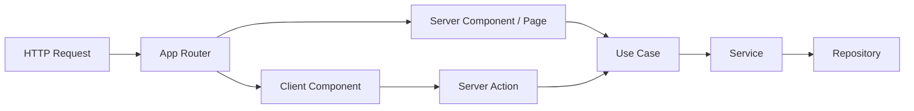

# Frontend Architecture

## Purpose

Define the Next.js frontend architecture for `apps/web`, including rendering strategy, routing conventions, and feature organization.

**Must be read together with** [engineering-architecture.md](./engineering-architecture.md) — the primary reference for layers, thin files, and prohibited practices.

## Scope

Covers `apps/web` only. Shared UI primitives live in `@repo/ui`; see [Frontend Standards](../05-standards/frontend-standards.md) and [Design System](../05-standards/design-system.md).

## Responsibilities

| Layer | Responsibility |
|-------|----------------|
| App Router (`app/`) | Thin routes — compose UI only |
| Feature modules (`features/`) | Components, use cases, services, hooks, schemas |
| `@repo/ui` | Atoms and molecules only (no business logic) |
| Server Components | Default; invoke use cases or services for data |
| Client Components | Interactivity, browser APIs, AI streaming UI |
| Server Actions | Validate input; invoke use case; return response |

---

## Next.js Architecture

- **Framework:** Next.js 16+ with App Router
- **React:** React 19
- **Language:** TypeScript (strict)
- **Styling:** Tailwind CSS + shadcn/ui (target); CSS Modules during scaffold phase
- **Fonts:** `next/font` (Geist via local files today)

---

## App Router

### Directory layout (target)

```text
apps/web/
├── app/
│   ├── layout.tsx              # Root layout, providers, fonts
│   ├── page.tsx                # Landing (or redirect)
│   ├── (marketing)/            # Route group: public marketing pages
│   ├── projects/
│   │   ├── page.tsx
│   │   └── [slug]/page.tsx
│   ├── articles/
│   ├── contact/
│   ├── chat/                   # Digital twin
│   ├── admin/                  # Protected admin
│   └── api/                    # Route handlers (minimal; prefer Server Actions)
├── features/
│   ├── landing/
│   ├── portfolio/
│   ├── projects/
│   ├── articles/
│   ├── digital-twin/
│   ├── analytics/
│   ├── receipt/
│   ├── admin/
│   └── contact/
├── components/                 # App-wide layout components (header, footer)
└── lib/                        # App utilities (auth helpers, constants)
```

### Conventions

| Convention | Rule |
|------------|------|
| Route files | Thin — compose feature components; call use cases only |
| Server Actions | Validate (Zod) → use case → response; no business logic |
| Metadata | `export const metadata` or `generateMetadata` per route |
| Loading | `loading.tsx` for route-level suspense |
| Errors | `error.tsx` with recovery actions |

---

## Server Components

Default choice for:

- Page shells and static content
- Database reads via `@repo/database`
- SEO-critical HTML

```tsx
// app/projects/page.tsx (example — thin page)
import { ProjectList } from "@/features/projects/components/project-list";
import { listProjectsUseCase } from "@/features/projects/use-cases/list-projects.use-case";

export default async function ProjectsPage() {
  const projects = await listProjectsUseCase();
  return <ProjectList projects={projects} />;
}
```

**Rules:**

- No `useState`, `useEffect`, or event handlers in Server Components
- **No Prisma** in pages, layouts, or components
- Pass serializable props to Client Components
- Use `cache()` for deduplicated reads within a request

---

## Client Components

Required for:

- Digital twin chat (streaming, input state)
- Interactive filters, modals, theme toggle
- Framer Motion animations (with reduced-motion guard)

Mark with `"use client"` at the top of the file. Keep Client Components **leaf-level** — push the boundary as deep as possible.

```tsx
"use client";

import { useChat } from "@/features/digital-twin/hooks/use-chat";

export function ChatPanel() {
  const { messages, send, isStreaming } = useChat();
  // ...
}
```

---

## Rendering Strategy

| Page type | Strategy |
|-----------|----------|
| Landing, portfolio | Static generation (SSG) or ISR with revalidation |
| Project/article detail | SSG/ISR from slug; `generateStaticParams` where feasible |
| Admin | Dynamic, authenticated |
| Digital twin chat | Dynamic; Client Component for stream consumption |
| Contact form | Server Action POST; static shell |



### Caching

- Use Next.js `fetch` cache and `revalidate` tags for content pages
- `revalidatePath` / `revalidateTag` after admin content updates
- Do not cache personalized or authenticated responses at CDN without Vary headers

---

## Routing Conventions

| Path | Feature |
|------|---------|
| `/` | Landing |
| `/portfolio` | Portfolio overview |
| `/projects`, `/projects/[slug]` | Projects |
| `/articles`, `/articles/[slug]` | Articles |
| `/chat` | Digital twin |
| `/contact` | Contact |
| `/admin/*` | Admin (auth required) |

- Use kebab-case for URLs
- One primary layout per section; nested layouts for admin
- Redirect legacy paths via `next.config.js` when renaming

---

## Feature Organization

Each feature under `features/<name>/` follows [engineering-architecture.md](./engineering-architecture.md):

```text
features/projects/
├── components/       # Organisms+ (business UI only)
├── services/         # Business rules
├── use-cases/        # Application orchestration
├── hooks/            # Client hooks
├── schemas/          # Zod validation
├── actions/          # Thin Server Actions
├── types/
├── constants/
├── utils/
├── tests/
└── assets/
```

**Colocation principle:** Everything needed to understand "projects" lives under `features/projects/` except atoms/molecules in `@repo/ui` and repositories in `@repo/database`.

Cross-feature imports go through public feature APIs (`features/projects/index.ts`), not deep paths.

### Atomic Design boundary

| Location | Contains |
|----------|----------|
| `@repo/ui` | Atoms, molecules (Button, Input, Form Field, Tag) |
| `features/*/components/` | Organisms and templates (ProjectHero, ChatWindow) |

---

## Best Practices

- Prefer Server Components; add `"use client"` only when necessary.
- Keep pages and actions thin; business logic in services.
- Co-locate feature code; never access Prisma from UI layers.
- Use `next/image` for all content images with explicit dimensions.
- Implement `generateMetadata` for all public content pages.
- Test keyboard navigation on every interactive feature.

## Examples

**Good:** `features/articles/components/article-body.tsx` is a Server Component rendering MDX.

**Good:** `features/digital-twin/components/chat-input.tsx` is a small Client Component at the leaf.

**Avoid:** `ProjectCard.tsx` calling Prisma or containing publish business rules.

**Avoid:** Making `app/layout.tsx` a Client Component — use composition instead.

## Anti-patterns

- Business logic in components, pages, or layouts
- Prisma imports in `apps/web` feature code (use repositories)
- Fetching in `useEffect` what a Server Component + use case can handle
- Giant `components/` folder with no feature affiliation.
- Importing admin code into public bundles (split routes and use dynamic imports).
- Client-side-only rendering of article content (hurts SEO and a11y).

## Future Improvements

- Partial Prerendering (PPR) for hybrid static + dynamic regions
- View Transitions API for page navigations
- Shared `@repo/features` package if features are reused across `web` and `docs`

## References

- [Engineering Architecture](./engineering-architecture.md)
- [ADR-0002: Next.js App Router](../04-adr/0002-nextjs.md)
- [ADR-0006: Layered Architecture](../04-adr/0006-layered-architecture.md)
- [ADR-0003: shadcn/ui](../04-adr/0003-shadcn.md)
- [Monorepo](./monorepo.md)
- [Frontend Standards](../05-standards/frontend-standards.md)
- [Next.js App Router docs](https://nextjs.org/docs/app)
