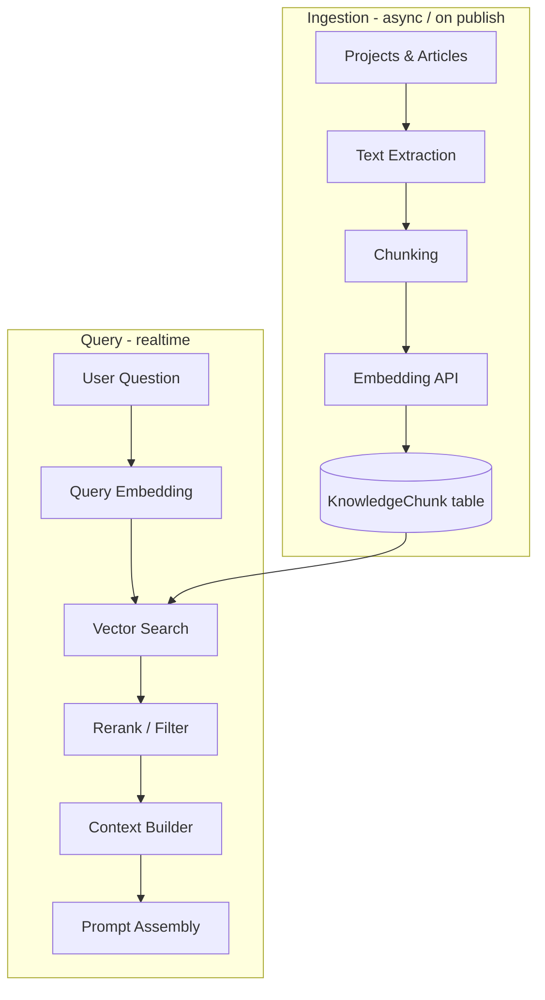

# RAG Architecture

## Purpose

Document the retrieval-augmented generation (RAG) pipeline: knowledge ingestion, embeddings, vector search, context building, prompt assembly, and source attribution.

## Scope

End-to-end RAG for the digital twin, grounded in published portfolio content (projects, articles, and configured knowledge sources).

## Responsibilities

| Stage | Responsibility |
|-------|----------------|
| Ingestion | Extract text from content sources, chunk, store metadata |
| Embedding | Generate vector representations via provider API |
| Indexing | Store vectors in PostgreSQL (pgvector) |
| Retrieval | Similarity search + optional reranking |
| Context building | Select and format chunks within token budget |
| Prompt assembly | Inject context into prompts (via AI Gateway) |
| Attribution | Map chunks to public URLs for citations |

---

## Pipeline Overview



---

## Knowledge Ingestion

### Sources (v1)

| Source | Trigger | Content |
|--------|---------|---------|
| Projects | Publish / update | Title, description, tech stack, body |
| Articles | Publish / update | Title, excerpt, MDX body |
| Site config | Manual | Bio, skills, FAQ (optional) |

### Ingestion flow

1. **Extract** — Plain text from MDX/HTML; strip navigation and scripts
2. **Normalize** — Consistent whitespace, heading hierarchy preserved in metadata
3. **Chunk** — Split into overlapping segments (see below)
4. **Embed** — Batch embed via provider
5. **Upsert** — Delete stale chunks for `sourceId`, insert new rows

Run ingestion:

- On admin publish (Server Action → queue job or inline for small content)
- Via CLI script: `pnpm --filter @repo/database ingest:all`

### Chunking strategy

| Parameter | Default | Rationale |
|-----------|---------|-----------|
| Chunk size | ~512 tokens | Balance context vs. precision |
| Overlap | 64 tokens | Preserve sentences split at boundaries |
| Splitter | Markdown-aware | Respect headings and code blocks |

Store per chunk:

- `sourceType` — `project` \| `article` \| `config`
- `sourceId` — Stable ID (slug or UUID)
- `sourceUrl` — Public path for citations
- `title` — Display title
- `chunkIndex` — Order within source
- `content` — Plain text
- `embedding` — `vector(1536)` or model-specific dimension

---

## Embeddings

- **Provider:** OpenAI `text-embedding-3-small` (default) or equivalent
- **Dimension:** Must match pgvector column and index
- **Batching:** Up to provider limit per request during ingestion
- **Caching:** Hash content; skip re-embed if unchanged

Environment:

- `EMBEDDING_MODEL`
- `EMBEDDING_DIMENSIONS`
- Same API key as LLM or dedicated key

---

## Vector Search

### PostgreSQL + pgvector

```sql
-- Conceptual query
SELECT id, content, source_url, title,
       1 - (embedding <=> $query_embedding) AS similarity
FROM knowledge_chunks
WHERE similarity > $threshold
ORDER BY embedding <=> $query_embedding
LIMIT $top_k;
```

### Parameters

| Parameter | Default |
|-----------|---------|
| `top_k` | 8 |
| `similarity_threshold` | 0.7 (tune per eval) |
| `max_context_tokens` | 3000 |

### Filters

- Only `published` content
- Optional metadata filters (e.g., `sourceType = 'article'`)

### Future: hybrid search

Combine vector similarity with PostgreSQL full-text search (`tsvector`) for exact keyword matches (project names, acronyms).

---

## Context Building

1. Retrieve candidate chunks
2. Deduplicate by `sourceId` (keep highest similarity per source)
3. Sort by similarity or reading order within same source
4. Accumulate until `max_context_tokens` exceeded
5. Format as numbered sources:

```text
[1] Title: "Building RAG with pgvector" (https://example.com/articles/rag)
Content: ...

[2] Title: "Project: Portfolio Platform" (https://example.com/projects/platform)
Content: ...
```

---

## Prompt Assembly

Handled by AI Gateway + Prompt Builder ([ai.md](./ai.md)):

- System instructions require citing `[n]` matching numbered sources
- If no chunk exceeds threshold, instruct model to say it lacks information
- Post-process model output to map `[n]` to `ChatChunk` citation events

---

## Source Attribution

| Requirement | Implementation |
|-------------|----------------|
| UI shows sources | Citation cards below assistant messages |
| Links are public | Only `sourceUrl` values that exist as routes |
| Traceability | Log `chunkIds` per response in `AiMessage` |

```typescript
type Citation = {
  index: number;
  sourceType: string;
  sourceId: string;
  title: string;
  url: string;
};
```

---

## Best Practices

- Re-ingest on content update; never serve stale embeddings for published content.
- Monitor retrieval hit rate and average similarity in observability.
- Evaluate with a fixed set of questions and expected source IDs.
- Keep chunk text human-readable for debugging in admin.
- Do not index draft or admin-only content.

## Examples

**User:** "What stack did you use for the portfolio platform?"

**Retrieval:** Returns chunks from project detail mentioning Next.js, Prisma, pgvector.

**Response:** Answer cites `[1]` linking to `/projects/portfolio-platform`.

## Anti-patterns

- Stuffing entire articles into one embedding (poor retrieval precision).
- Citing sources not included in retrieved context.
- Indexing PII or private receipt data into the public knowledge base.
- Skipping deletion of chunks when content is unpublished.

## Future Improvements

- Reranker model (Cohere, cross-encoder) on top-k results
- Multimodal embeddings for project screenshots
- Incremental ingestion via webhooks
- User feedback loop ("was this helpful?") to tune thresholds

## References

- [AI Architecture](./ai.md)
- [Database Architecture](./database.md)
- [ADR-0005: RAG with pgvector](../04-adr/0005-rag.md)
- [AI Standards](../05-standards/ai-standards.md)
- [Digital Twin Feature](../02-features/digital-twin/technical.md)
