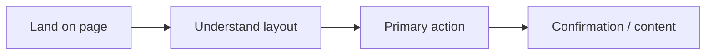

# Analytics — UX Specification

## Purpose

Define user experience, flows, and interaction design for **Analytics**.

## Scope

UX and accessibility requirements for this feature. Visual tokens reference [design-system.md](../../05-standards/design-system.md).

## Responsibilities

| Role | Responsibility |
|------|----------------|
| Frontend agent | Implement responsive, accessible UI per this spec |
| QA agent | Validate against acceptance and a11y criteria |

## User Flows

### Primary flow

1. User navigates to the analytics entry point (see [technical.md](./technical.md) for routes).
2. User scans primary content and key actions.
3. User completes the main goal (read, submit, filter, or chat as applicable).
4. User receives clear feedback (success, error, or loading states).

### Secondary flows

- Mobile navigation via header menu
- Keyboard-only navigation through all interactive elements
- Error recovery (network failure, validation errors)

## Layout & Components

- Use shared header/footer from app shell
- Apply design system typography and spacing
- Loading: skeleton states for async regions
- Empty states: helpful copy and CTA where relevant

## Accessibility

- WCAG 2.2 AA contrast and focus indicators
- All forms labeled; errors associated with fields
- `prefers-reduced-motion`: disable non-essential animation
- Screen reader announcements for dynamic updates (especially digital-twin)

## Responsive Behavior

| Breakpoint | Behavior |
|------------|----------|
| Mobile (<640px) | Single column, touch targets ≥44px |
| Tablet | Adaptive grid |
| Desktop | Full layout per design system max-width |

## Best Practices

- Content-first layout; minimize chrome
- Progressive disclosure for advanced actions
- Consistent CTA placement with landing page patterns

## Examples

**Happy path:** User accomplishes primary goal in ≤3 interactions from entry.

**Error path:** Validation message appears inline; focus moves to first invalid field.

## Anti-patterns

- Invisible focus outlines
- Icon-only buttons without `aria-label`
- Layout shift during font or image load (use dimensions/reserve space)

## Future Improvements

- User testing scripts for usability validation
- Localized copy if i18n is added

## References

- [Brief](./brief.md)
- [Design System](../../05-standards/design-system.md)
- [Frontend Standards](../../05-standards/frontend-standards.md)
