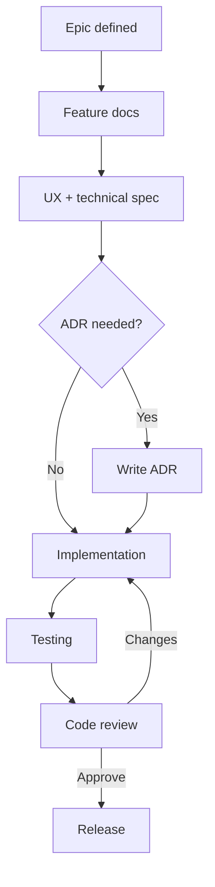

# Development Workflow

## Purpose

Describe the end-to-end workflow from epic planning through release for the AI Engineering Portfolio Platform.

## Scope

Process for humans and AI agents collaborating via documentation-first development.

## Responsibilities

| Phase | Owner |
|-------|-------|
| Epic | Product owner / architect |
| Feature | Feature spec in `docs/02-features/` |
| Design | UX in feature `ux.md` + design system |
| Implementation | Engineers / agents |
| Testing | QA agent + implementers |
| Review | Reviewer agent + human |
| Release | Owner + CI/CD |

---

## Workflow Overview

---

## Epic

An **epic** maps to a roadmap milestone (e.g., M2 Core Content) or large initiative spanning multiple features.

**Inputs:** [roadmap.md](../00-product/roadmap.md), [vision.md](../00-product/vision.md)

**Outputs:**

- List of features affected
- Dependencies and sequencing
- Success metrics for the epic

---

## Feature

Before significant implementation:

1. Ensure `docs/02-features/<name>/brief.md` exists
2. Complete `ux.md`, `technical.md`, `acceptance.md`, `tasks.md`
3. Link feature to milestone in roadmap

**Gate:** No epic-scale implementation without `acceptance.md`.

---

## Design

- Apply [design-system.md](../05-standards/design-system.md)
- UX flows in feature `ux.md`
- Optional mockups (external or screenshots in PR)
- a11y requirements stated upfront

---

## Implementation

1. Create branch per [branching.md](./branching.md)
2. Scaffold feature module `apps/web/features/<name>/`
3. Follow [code-style.md](../05-standards/code-style.md) and architecture docs
4. Commit in small logical units
5. Update docs if behavior differs from spec

**Agents:** Use role docs in `docs/03-agents/` for boundaries.

---

## Testing

Per [testing.md](../05-standards/testing.md):

- Unit/integration during implementation
- E2E before marking feature complete
- Verify feature `acceptance.md` checklist
- QA agent sign-off for releases

---

## Review

- Open PR with description linking feature and acceptance criteria
- Reviewer checks code, architecture, security, docs ([reviewer agent](../03-agents/reviewer.md))
- Address blockers; suggestions optional
- CI must pass (lint, types, tests, build)

---

## Release

1. Merge to `main`
2. CI builds Docker image → ECR → EC2 deploy (current setup)
3. Run `prisma migrate deploy` before or during deploy (when DB exists)
4. Smoke test production URLs
5. Monitor logs and metrics post-deploy ([observability](../08-observability/observability.md))
6. Rollback via previous image tag if needed ([deployment](../07-deployment/deployment.md))

---

## Best Practices

- Documentation-first: update specs before or with code
- Vertical slices over long-lived feature branches
- Keep PRs reviewable (<400 lines when possible)
- Demo features against acceptance criteria, not only happy path

## Examples

**Feature workflow:** `contact` → read acceptance → implement Server Action → E2E test → PR → deploy.

**ADR workflow:** Choosing auth provider → ADR Proposed → review → Accepted → implement.

## Anti-patterns

- Code-first, docs-never
- Merging with failing CI
- Skipping review for "small" security-sensitive changes

## Future Improvements

- GitHub issue templates linked to feature folders
- Automated acceptance checklist in PR template

## References

- [Branching](./branching.md)
- [Checklist](./checklist.md)
- [Roadmap](../00-product/roadmap.md)
- [Engineering Principles](../00-product/engineering-principles.md)
