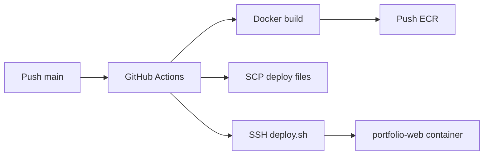

# Deployment

## Purpose

Document local development, environment configuration, containerization, CI/CD, health checks, and rollback for the AI Engineering Portfolio Platform.

## Scope

Deployment of `apps/web` to production. Database and observability setup included as target-state guidance alongside current EC2 pipeline.

## Responsibilities

| Component | Owner |
|-----------|-------|
| Dockerfile / compose | Platform / DevOps |
| GitHub Actions | CI/CD pipeline |
| EC2 host | Operations |
| Env secrets | Portfolio owner |
| Migrations | Implementer at deploy time |

---

## Local Development

### Prerequisites

- Node.js ≥ 18 (20 recommended)
- pnpm 9 (`corepack enable && corepack prepare pnpm@9.0.0 --activate`)
- Docker (optional, for local PostgreSQL)

### Setup

```bash
git clone <repo-url>
cd portfolio-red
pnpm install
cp .env.example .env   # when available
pnpm dev
```

| App | URL |
|-----|-----|
| web | http://localhost:3000 |
| docs | http://localhost:3001 |

### Local database (target)

```bash
docker compose -f docker-compose.dev.yml up -d   # planned
pnpm --filter @repo/database prisma migrate dev
pnpm --filter @repo/database db:seed
```

### Build verification

```bash
pnpm exec turbo build --filter=web
pnpm exec turbo lint --filter=web
pnpm exec turbo check-types --filter=web
```

---

## Environment Variables

### Application (target)

| Variable | Required | Description |
|----------|----------|-------------|
| `DATABASE_URL` | Yes | PostgreSQL connection string |
| `DIRECT_URL` | Migrations | Direct DB URL (bypass pooler) |
| `NODE_ENV` | Yes | `development` / `production` |
| `AI_PROVIDER` | M3+ | `openai`, `anthropic`, etc. |
| `AI_MODEL` | M3+ | Chat model ID |
| `AI_MAX_TOKENS` | M3+ | Max completion tokens |
| `OPENAI_API_KEY` | M3+ | Provider key (server only) |
| `EMBEDDING_MODEL` | M3+ | Embedding model ID |
| `AUTH_SECRET` | M4+ | Session encryption |
| `ADMIN_EMAIL` | M4+ | Initial admin (bootstrap) |

### Deployment / CI (current EC2)

| Variable | Where | Description |
|----------|-------|-------------|
| `AWS_ACCESS_KEY_ID` | GitHub Secrets | CI AWS auth |
| `AWS_SECRET_ACCESS_KEY` | GitHub Secrets | CI AWS auth |
| `AWS_REGION` | Secrets / EC2 | Region |
| `ECR_REPOSITORY` | Secrets / EC2 | ECR repo name |
| `ECR_REGISTRY` | deploy.sh | ECR registry URL |
| `EC2_HOST` | GitHub Secrets | SSH target |
| `EC2_USER` | GitHub Secrets | SSH user |
| `EC2_SSH_PRIVATE_KEY` | GitHub Secrets | SSH key |
| `IMAGE_TAG` | deploy.sh | Default `latest` |
| `HOST_PORT` | deploy.sh | Host port → 3000 |
| `DEPLOY_DIR` | deploy.sh | Default `~/portfolio-red` |

**Never commit secrets.** Document all vars in `.env.example` at repo root.

---

## Docker

### Production Dockerfile (current)

Multi-stage build at repo root:

1. **deps** — `pnpm install --frozen-lockfile`
2. **builder** — `pnpm turbo build --filter=web`
3. **runner** — Next.js standalone `node apps/web/server.js`

Key `apps/web/next.config.js` settings:

```javascript
output: "standalone",
outputFileTracingRoot: path.join(__dirname, "../../"),
```

### Runtime compose (`deploy/docker-compose.yml`)

```yaml
services:
  web:
    image: ${ECR_REGISTRY}/${ECR_REPOSITORY}:${IMAGE_TAG}
    container_name: portfolio-web
    ports:
      - "${HOST_PORT:-80}:3000"
    environment:
      NODE_ENV: production
```

### Local dev compose (planned)

- PostgreSQL 16 with pgvector
- Optional Redis for rate limiting (future)

---

## Dokploy

[Dokploy](https://dokploy.com/) is a self-hosted PaaS alternative for Docker deployments.

### Target Dokploy setup

1. Create application pointing to Git repository
2. Build: Dockerfile at root (same as EC2)
3. Set env vars in Dokploy UI (mirror `.env.example`)
4. Attach managed PostgreSQL or external DB
5. Configure domain + TLS (Traefik via Dokploy)
6. Health check path: `/api/health` (to implement)

### EC2 vs Dokploy

| Aspect | EC2 + ECR (current) | Dokploy (planned option) |
|--------|---------------------|---------------------------|
| CI | GitHub Actions | Git webhook or Actions |
| TLS | Manual / ALB | Dokploy Traefik |
| DB | External | Plugin or managed |
| Ops | SSH + deploy.sh | UI + logs |

Both can coexist as documented options; choose one primary per environment.

---

## CI/CD

### Current pipeline (`.github/workflows/deploy-ec2.yml`)

**Trigger:** Push to `main`, `workflow_dispatch`



**Image tags:** `github.sha`, `latest`

### Target CI additions

| Job | Purpose |
|-----|---------|
| lint | ESLint all packages |
| check-types | TypeScript |
| test | Vitest unit/integration |
| e2e | Playwright (on main or nightly) |
| migrate | `prisma migrate deploy` staging |

Deploy job should depend on test jobs before promoting to production.

---

## Health Checks

### Target endpoints

| Endpoint | Purpose |
|----------|---------|
| `GET /api/health` | Liveness: app responds |
| `GET /api/health/ready` | Readiness: DB connected |

Response example:

```json
{ "status": "ok", "db": "connected", "version": "abc123" }
```

### Infrastructure

- Docker `HEALTHCHECK` or compose healthcheck curling `/api/health`
- ALB/load balancer target group health check (if used)
- Uptime monitor external to host

---

## Rollback Strategy

### Application rollback (EC2)

1. Identify previous image digest or `github.sha` tag in ECR
2. On EC2:

```bash
export IMAGE_TAG=<previous-sha>
cd ~/portfolio-red
./deploy.sh
```

3. Verify health and smoke tests
4. Monitor error rates

### Database rollback

- **Prefer forward-fix migrations** over down migrations in production
- Keep migrations backward-compatible during rolling deploys (expand-contract)
- Backup PostgreSQL before deploy (`pg_dump`) when migration is risky

### When to rollback

- Health check failing > 5 minutes
- Error rate spike > 5x baseline
- Critical security issue in release

---

## Best Practices

- Deploy during low-traffic windows when possible
- Run migrations before switching traffic to new app version
- Pin production to immutable `github.sha` tags for rollbacks (avoid `latest` only in prod)
- Smoke test after every deploy

## Examples

**Happy deploy:** CI green → image `abc123` pushed → deploy.sh → health OK → monitor 30 min.

**Rollback:** New release breaks DB → deploy previous image → forward migration fix in hotfix branch.

## Anti-patterns

- Manual edits on EC2 not in git
- `latest` tag only with no record of previous SHA
- Skipping migrations while app expects new schema

## Future Improvements

- Blue/green or canary deploys
- Staging environment mirroring production
- Automated backup before migrate in CI
- Dokploy as primary with EC2 deprecated

## References

- [Observability](../08-observability/observability.md)
- [Database Architecture](../01-architecture/database.md)
- [Development Checklist](../06-development/checklist.md)
- [ADR-0001: Monorepo](../04-adr/0001-monorepo.md)
