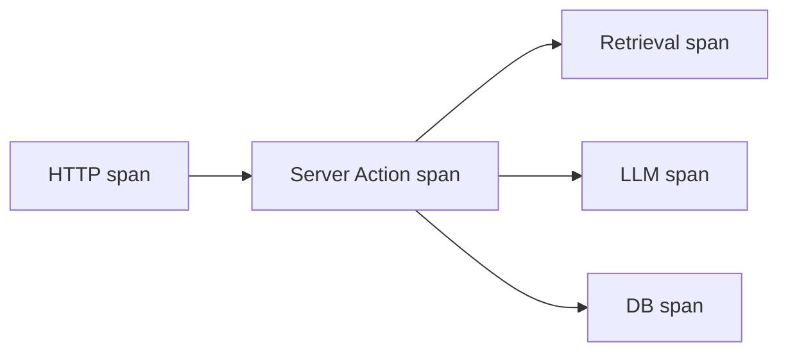

# Observability

## Purpose

Define logging, metrics, tracing, AI token/cost monitoring, session analytics, dashboards, and alerts for operating the platform in production.

## Scope

Runtime visibility for `apps/web`, `@repo/ai`, `@repo/database`, and infrastructure. Complements [AI standards](../05-standards/ai-standards.md) token accounting.

## Responsibilities

| Area | Owner |
|------|-------|
| App instrumentation | Backend / AI implementers |
| Dashboards | Operations / owner |
| Alerts | Operations / owner |
| Privacy review | Owner before enabling analytics |

---

## Logging

### Format

Structured **JSON** logs in production:

```json
{
  "level": "info",
  "message": "chat.completion",
  "requestId": "req_abc",
  "sessionId": "sess_xyz",
  "feature": "digital-twin",
  "model": "gpt-4o-mini",
  "latencyMs": 1240,
  "timestamp": "2026-07-01T12:00:00.000Z"
}
```

### Levels

| Level | Use |
|-------|-----|
| `error` | Failures requiring attention |
| `warn` | Degraded behavior, rate limits |
| `info` | Request lifecycle, business events |
| `debug` | Verbose diagnostics (dev/staging only) |

### Rules

- Include `requestId` on all HTTP and AI requests (propagate from middleware)
- **Do not log** secrets, API keys, full prompts with PII, or contact form body at info level
- Log retrieval `chunkIds` and scores at debug
- Container logs collected via Docker/`journald` or log shipper

### Target tooling

- **Development:** pretty console
- **Production:** ship to Loki, CloudWatch Logs, or Axiom (choice via ADR when implementing)

---

## Metrics

### Application metrics

| Metric | Type | Labels |
|--------|------|--------|
| `http_requests_total` | Counter | method, route, status |
| `http_request_duration_ms` | Histogram | route |
| `ai_requests_total` | Counter | model, feature, status |
| `ai_tokens_total` | Counter | model, type (prompt/completion) |
| `ai_cost_usd_total` | Counter | model, feature |
| `ai_first_token_ms` | Histogram | model |
| `rag_retrieval_chunks` | Histogram | feature |
| `rag_similarity_score` | Histogram | feature |
| `db_query_duration_ms` | Histogram | operation |

### Infrastructure metrics

- CPU, memory, disk (EC2/host)
- Container restarts
- PostgreSQL connections, slow queries

### Target tooling

- Prometheus + Grafana, or
- OpenTelemetry → vendor backend (Honeycomb, Datadog)

---

## Tracing

Distributed traces for:

1. HTTP request → Server Action / route handler
2. AI gateway → retrieval → provider API
3. Prisma queries (optional instrumentation)

Use **OpenTelemetry** SDK with W3C trace context propagation.



Sample rate: 100% staging, 1–10% production (adjust for cost).

---

## Token Usage

Persist per request in `AiUsage` table ([database.md](../01-architecture/database.md)):

- `sessionId`, `model`, `promptTokens`, `completionTokens`, `estimatedCostUsd`, `timestamp`

Aggregate daily/weekly in admin analytics:

- Total tokens and cost by model
- Cost per feature (digital-twin vs future features)
- Top sessions by usage (for abuse detection)

---

## Cost Monitoring

| Control | Implementation |
|---------|----------------|
| Per-request estimate | Price table × token counts |
| Daily budget alert | e.g., Slack/email if > $X/day |
| Anomaly detection | Spike > 3σ vs 7-day average |
| Rate limits | Per [AI standards](../05-standards/ai-standards.md) |

Dashboard panels:

- Cost today / MTD
- Tokens in vs out
- Average cost per chat session

---

## Session Analytics

Privacy-conscious analytics for portfolio owner ([analytics feature](../02-features/analytics/brief.md)):

### Events (examples)

| Event | Properties |
|-------|------------|
| `page_view` | path, referrer (sanitized), locale |
| `chat_started` | sessionId (anonymous) |
| `chat_message` | role, tokenCount (not content in analytics) |
| `contact_submitted` | success boolean only |

### Privacy

- No third-party ad trackers by default
- Cookie banner if using non-essential cookies (jurisdiction-dependent)
- IP hashing or truncation for rate limiting, not stored raw in analytics long-term
- Respect Do Not Track where feasible

Storage: `AnalyticsEvent` table or lightweight product (Plausible self-hosted) — ADR when choosing.

---

## Dashboards

### Recommended dashboards

1. **Overview** — Request rate, error rate, p95 latency, uptime
2. **AI** — Tokens, cost, first-token latency, rate limit hits
3. **RAG** — Retrieval count, avg similarity, ingestion lag
4. **Business** — Page views, top content, chat sessions (from session analytics)
5. **Infrastructure** — CPU/memory, DB connections, disk

### Grafana folder structure (example)

- `portfolio / overview`
- `portfolio / ai`
- `portfolio / rag`

---

## Alerts

| Alert | Condition | Severity |
|-------|-----------|----------|
| High error rate | 5xx > 1% for 5m | Critical |
| Health check fail | 3 consecutive failures | Critical |
| AI cost spike | Daily cost > budget | Warning |
| DB connection exhaustion | > 90% pool | Warning |
| Disk low | < 15% free | Warning |
| Ingestion backlog | Jobs pending > 1h | Warning |

Alert channels: email, Slack, PagerDuty (optional for solo operator).

Runbooks link to [deployment.md](../07-deployment/deployment.md) rollback section.

---

## Best Practices

- Instrument at gateway boundaries, not every function
- Test alerts in staging (fire drill)
- Correlate logs with `requestId` and trace IDs
- Review PII in logs quarterly

## Examples

**Incident:** Error rate spike → dashboard shows DB timeout → check connection pool → scale or restart.

**Cost:** Alert fires → investigate session with 500 messages → tighten rate limit.

## Anti-patterns

- Logging full chat transcripts in production info logs
- Metrics without dashboards (data with no action)
- Alert fatigue from thresholds set too low

## Future Improvements

- SLOs and error budgets (e.g., 99.5% availability)
- Synthetic monitoring from external regions
- OpenTelemetry auto-instrumentation for Next.js

## References

- [AI Architecture](../01-architecture/ai.md)
- [AI Standards](../05-standards/ai-standards.md)
- [Deployment](../07-deployment/deployment.md)
- [Analytics Feature](../02-features/analytics/technical.md)
